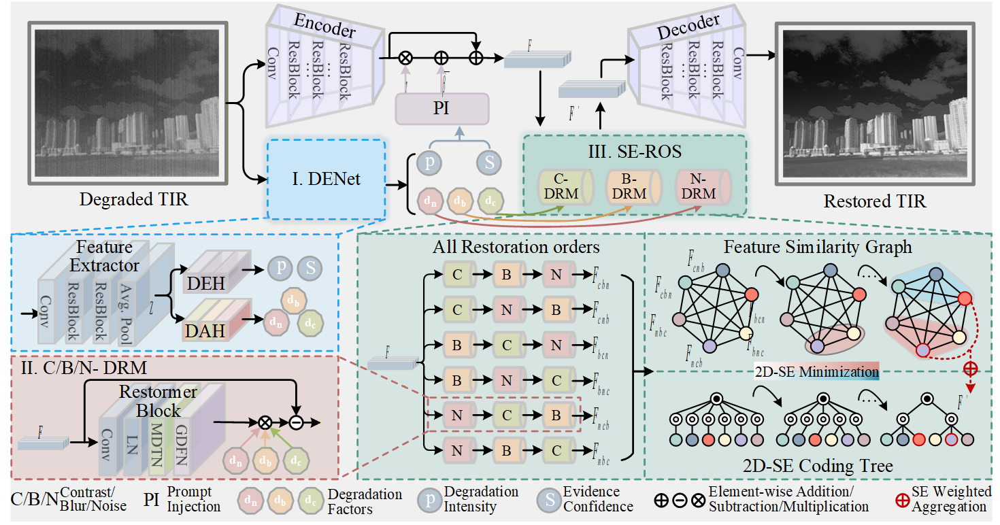

# Breaking Degradation Coupling: A Structural Entropy–Guided Decoupled Framework and Benchmark for Infrared Enhancement (SEGD) [CVPR Finding 2026]
## Pu Li, Huafeng Li, Yafei Zhang ,Yu Liu, Wen Wang*
---



---
## Night-TIR Dataset
The preview of our dataset is as follows.

---


 
---

### Data Peprocessing
Before training or evaluation, please first split the HM-TIR[1] dataset and apply the same degradation pipeline to both HM-TIR and Night-TIR images by running:
```
python ./codes/utils/Tir_Degradation.py
```
It is worth noting that real-world compound degradations are usually coupled and do not come with explicit degradation-order annotations. Therefore, the degradation addition order in our synthetic degradation pipeline is randomized. For PPFN, we use a predefined low-contrast → blur → noise restoration order during evaluation.

### Training
1. Before training, please first divide the HM-TIR training set into patches to generate training samples by running:
```
python ./codes/utils/Tir_patches.py
```
2. Please run the following command to train the Degradation-Aware Evidence Network (DENet):
```
python ./codes/train/train_DENet.py
```
3. Run the following command to warm up the Degradation Residual Modules (DRMs). Note that this step is optional:
```
python ./codes/train/train_DRMs.py
```
3. The model is trained on three single degradations, including low contrast, blur, and noise, as well as their composed degradations. To train the model, please run:
```
python ./codes/train/train_BackBone.py
```

### Evaluation
The evaluation covers synthetic degradations on HM-TIR[1] and Night-TIR, as well as real-world degraded dataset AWMM[2]. You can either test using your own trained checkpoints or load our pretrained weights from ```./ckpts/model.pth```, and then run:
```
python ./codes/inference.py
```

### Citation

Please cite us if our work is useful for your research.

```
@article{li2026breaking,
  title={Breaking Degradation Coupling: A Structural Entropy Guided Decoupled Framework and Benchmark for Infrared Enhancement},
  author={Li, Pu and Li, Huafeng and Zhang, Yafei and Liu, Yu and Wang, Wen},
  journal={arXiv preprint arXiv:2604.22886},
  year={2026}
}
```

### Any Question

If you have any other questions about the code and dataset, please email to lip@stu.kust.edu.cn or lipu2024626@gmail.com.

## References
[1] Liu, Jinyuan, et al. "Enhancing infrared vision: progressive prompt fusion network and benchmark." Advances in Neural Information Processing Systems 38 (2026): 96850-96875.

[2] Li, Xilai, et al. "All-weather multi-modality image fusion: Unified framework and 100k benchmark." Information Fusion (2026): 104130.
